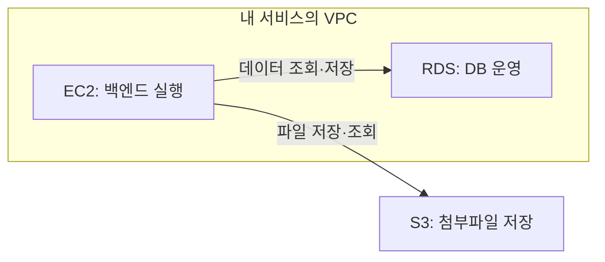

# VPC 서브넷·라우팅·보안

> VPC는 서버를 배치하는 가상 네트워크이며, 서브넷·경로·보안 규칙으로 통신 가능 범위를 정한다.

- **역할:** VPC는 Virtual Private Cloud의 약자로, 논리적으로 격리된 가상 네트워크다.
- **배치:** EC2와 RDS 같은 자원은 VPC의 서브넷에 배치하고, 서브넷은 하나의 가용 영역에 속한다.
- **접근:** public·private은 경로로 구분하며 실제 접속에는 주소와 보안 조건도 필요하다.

설명과 꼬리질문 펼치기

## 설명

AWS는 클라우드 플랫폼, VPC는 내 서비스의 네트워크, EC2 인스턴스는 프로그램을 실행하는 가상 서버다. “VPC가 배포하는 컴퓨터”라고 이해하면 실행 자원과 네트워크를 혼동하게 된다. VPC 자체가 프로그램이나 DB를 실행하지는 않는다.

백엔드에서는 EC2에서 애플리케이션을 실행하고 RDS에서 DB를 운영하도록 구성할 수 있다. 일반적인 S3 버킷은 VPC의 서브넷에 배치하는 자원이 아니며 애플리케이션에서 API로 접근한다.

위 그림은 역할을 설명하는 구성 예시다. 서브넷·게이트웨이·접근 규칙은 생략했다.

서브넷의 라우팅 테이블은 목적지에 따른 다음 경로를 정한다. 퍼블릭 서브넷은 인터넷 게이트웨이로 향하는 직접 경로가 있고, 프라이빗 서브넷은 그 직접 경로가 없다. 인터넷 게이트웨이 경로가 있는 서브넷에서도 인스턴스의 주소·보안·OS 방화벽 조건이 갖춰져야 인터넷 접근이 된다.

보안 그룹은 자원에 연결하는 상태 기반 허용 규칙이고, NACL은 서브넷 경계에서 적용하는 상태 비저장 허용·거부 규칙이다. NACL은 응답 트래픽도 별도로 허용해야 한다. NAT는 private 자원의 외부 시작 연결을 지원하는 선택지다. 예를 들어 DB 보안 그룹에서 애플리케이션 서버의 보안 그룹을 접속 출처로 지정하면 DB 접근 범위를 제한할 수 있다.

## 주의점

NAT 게이트웨이는 외부에서 임의로 내부 앱에 들어오는 공개 진입점이 아니다. `0.0.0.0/0` 경로가 있다고 모든 포트가 자동 허용되는 것은 아니다. VPC 안에 배치했다는 사실만으로 DB 접근이 자동 차단되거나 허용되지도 않는다.

## 꼬리질문

1. VPC와 EC2는 각각 어떤 역할을 하며, VPC가 프로그램을 실행하는 컴퓨터가 아닌 이유는 무엇일까?
2. 인터넷 게이트웨이 경로가 있어도 EC2에 접속할 수 없다면 공인 IP·보안 그룹·NACL·서버 리스닝에서 무엇을 확인할까?
3. 프라이빗 EC2가 외부 API를 호출해야 할 때 NAT가 제공하는 연결과 외부 사용자가 들어오는 연결은 어떻게 다를까?

함께 복습: [EC2·AMI·블록 스토리지](../ec2/instance-ami-storage.md) · [S3 객체와 저장소 선택](../s3/object-storage.md)

## 참고 자료

- [AWS · Amazon VPC](https://docs.aws.amazon.com/vpc/latest/userguide/what-is-amazon-vpc.html) — VPC의 뜻과 서브넷·라우팅·게이트웨이 역할을 확인한다.
- [AWS · Security groups](https://docs.aws.amazon.com/vpc/latest/userguide/vpc-security-groups.html) — 자원별 접속 규칙과 상태 기반 동작을 확인한다.
- [AWS · Network ACLs](https://docs.aws.amazon.com/vpc/latest/userguide/vpc-network-acls.html) — 서브넷 경계의 규칙과 응답 트래픽 처리 차이를 확인한다.
